# UX
## Project Goals
The goal of this project is to design and develop a full-stack e-commerce website for retro video games. The website allows users to browse a collection of retro games and filter games by console, genre, and availability. Each graded item represents a unique product instance with its own condition and pricing, reflecting a real-world collectible marketplace.

## User Stories

1. As a user, I want to create an account so that I can save my basket and wishlist.

    **Acceptance Criteria**
    - User can register with email and username
    - User can log in and log out successfully
    - User session persists across pages

2. As a user, I want to browse available retro games so I can find items to purchase.

    **Acceptance Criteria**
    - User can see list of games
    - Each game displays title, console, genre, and image

3. As a user, I want to view detailed information about a game so I can decide if I want to buy it.

    **Acceptance Criteria**
    - Clicking a game opens the detail page
    - Page shows all relevant information
    
4. As a user, I want to filter games by console, genre, price, and grade so I can find specific items quickly.

    **Acceptance Criteria**
    - User can filter by console, genre, price, and grade
    - Results update based on filter selection

    **Notes**
    - Filtering was adapted to better reflect the data model. Console, genre, and availability filtering were implemented at game level, while price and grade filtering were excluded as these are attributes of individual graded items rather than the game itself.

5. As a user, I want to add graded games to my basket so I can purchase them later.

    **Acceptance Criteria**
    - User can add items to basket
    - Basket updates correctly with selected items

6. As a user, I want to view my basket so I can see selected items and total cost.

    **Acceptance Criteria**
    - Basket shows all selected items
    - Total price is calculated correctly
    

7. As a user, I want to update or remove items in my basket so I can adjust my purchase before checkout.

    **Acceptance Criteria**
    - User can increase/decrease quantity
    - User can remove items from basket

    **Notes**
    - Quantity adjustment was not implemented as each graded item is a unique product instance.
    

8. As a user, I want to securely pay for my items so I can complete my purchase.

    **Acceptance Criteria**
    - User can complete payment using Stripe test mode
    - Successful payment redirects to confirmation page

9. As a user, I want to see a confirmation after payment so I know my order was successful.

    **Acceptance Criteria**
    - User sees order summary after payment
    - Order is saved in database

10. As a user, I want to save items to a wishlist so I can view them later.

    **Acceptance Criteria**
    - User can save items to wishlist
    - Wishlist persists across sessions

11. As a site owner, I want to add, edit, and delete products so I can manage inventory.

    **Acceptance Criteria**
    - Admin can add new games and graded items
    - Changes update on site

12. As a user, I want to view my past orders so I can track my purchases.

    **Acceptance Criteria**
    - User can see all previous orders
    - Each order shows purchased items and totals

## Wireframes

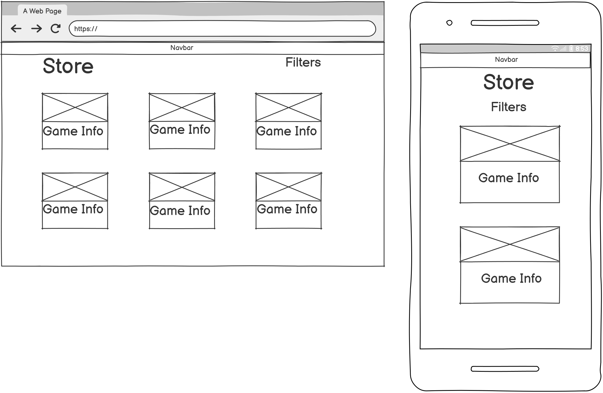

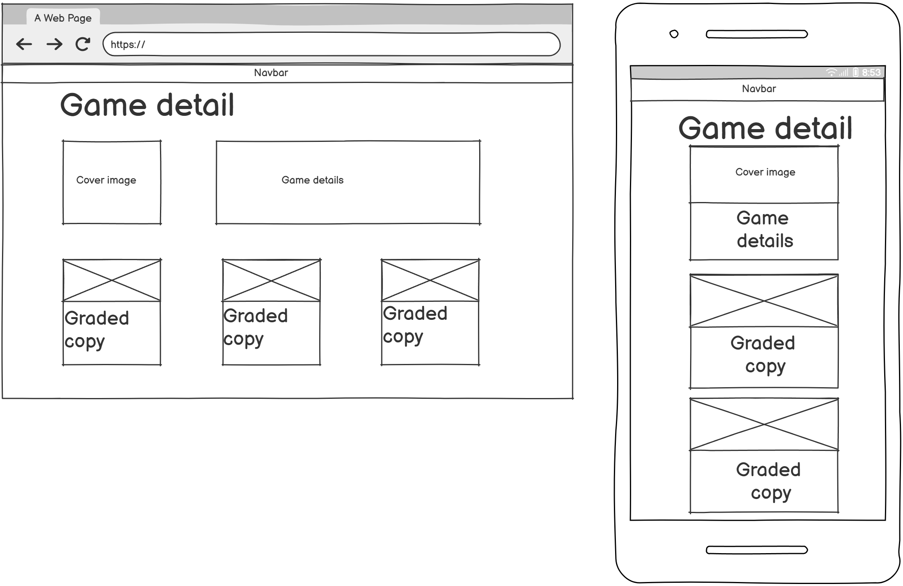

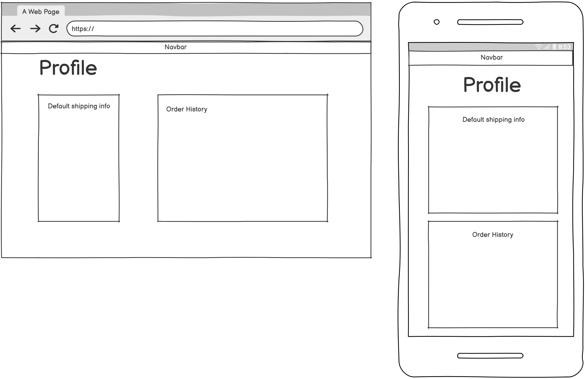

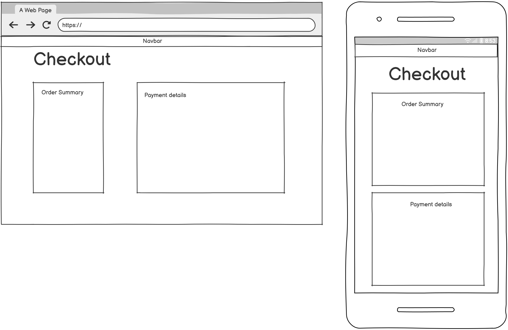

## Design Choices
The Retro Store was desgined to look like retro arcade games while still feeling modern and maintaining readability and usability throughout.
The overall design uses a dark theme combined with neon accent colours. Consistency was prioritised across all pages to ensure users can navigate the site intuitively.

### Colour Scheme
* Navy Blue (#0f172a) - Page background
* Black (#000000) - Card background
* Neon Blue (#00e5ff) - Buttons & titles
* Neon Pink (#d946ef) - Card borders & hover effects
* Ghost White (#f8fafc) - Text colour for contrast

### Fonts
Two fonts were chosen for the retro yet modern identity of the website while maintaining readability:

* **Orbitron:** used for headings and branding elements, including the homepage hero section
* **Electrolize:** used for body text to improve readability across desktop and mobile devices

### Layout
The website uses a responsive, card-based layout built with Bootstrap. Each page feels unique but with consistent elements to clearly be part of the same website.

Key layout decisions include:

* A responsive navigation bar that collapses on smaller screens
* Consistent card styling across the store, basket, wishlist, checkout, and profile pages
* Large product images to showcase games and graded items
* Mobile-first responsive design to ensure usability across different screen sizes

### Imagery
Game cover images are used in the store page and game detail page for recognisability, whereas individual slab images are used for graded copies so the user knows exactly what they are buying.

# Database Design
The database structure was designed so users can browse games, purchase unique graded items, save wishlist entries, and view their order history.

## Models

#### Game
The Game model stores information about each retro game.

* title
* console
* genre
* description
* cover_image

Each game can have multiple graded copies linked through a one-to-many relationship.

#### GradedItem
The GradedItem model stores individual graded copies of a game.

* game
* grade
* price
* is_available
* slab_image
* created_at

Each graded item belongs to a single game and represents a unique product.

#### Wishlist
The Wishlist model stores a user's wishlist.

* user_profile

Each wishlist belongs to one user profile and can contain multiple wishlist items.

#### WishlistItem
The WishlistItem model stores individual games saved to a wishlist.

* wishlist
* game
* notes

Each wishlist item belongs to one wishlist and references one game.

#### Order
The Order model stores information about customer purchases.

* order_number
* user
* shipping information (name, address etc)
* stripe_pid
* order_total
* created_at

Each order belongs to one user and can contain multiple order line items.

#### OrderLineItem
The OrderLineItem model stores the products purchased within an order.

* order
* graded_item
* item_price

Each order line item connects an order with a graded item.

## Relationships
The models are connected using OneToOneField and ForeignKey relationships:

* A UserProfile has one Wishlist
* A Wishlist can have many WishlistItems
* A WishlistItem belongs to one Wishlist and one Game
* A Game has many GradedItems
* A User can have many Orders
* An Order can have many OrderLineItems
* A GradedItem belongs to one Game
* A GradedItem can be purchased through an OrderLineItem
* An OrderLineItem belongs to one Order and one GradedItem

# Features
## Existing Features
#### User Authentication

* User registration, login, and logout using Django Allauth
* Persistent user sessions
* Personal profile page for authenticated users

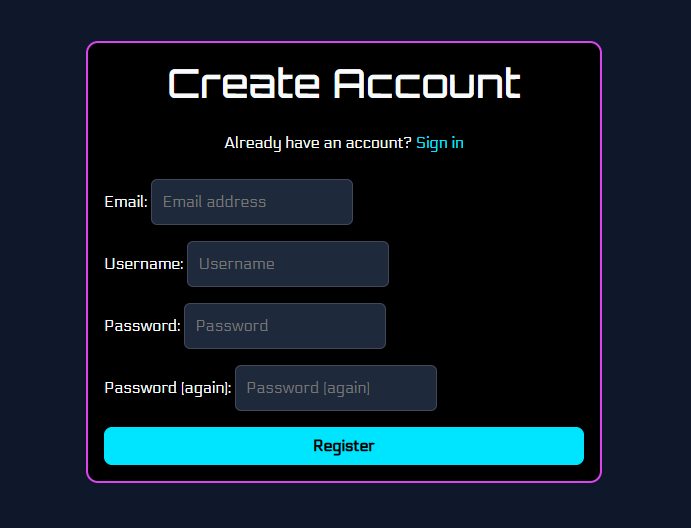

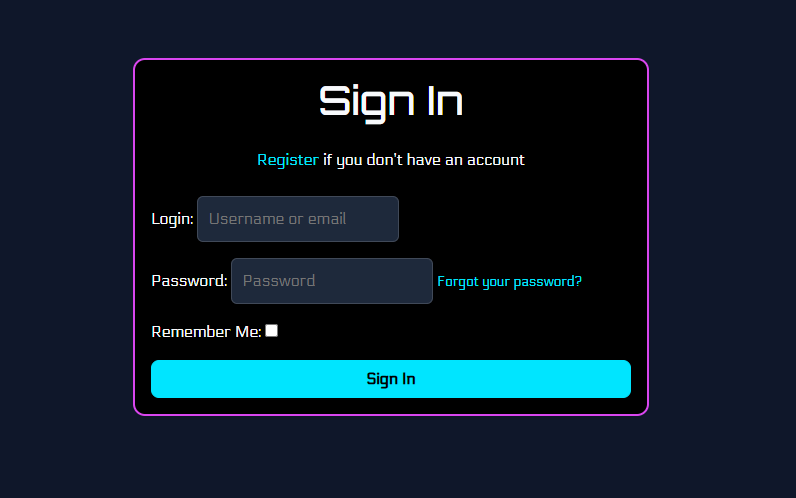

#### Homepage

* Custom hero section introducing the Retro Store brand
* Retro styling using a dark theme with neon accent colours
* Call-to-action button linking directly to the store

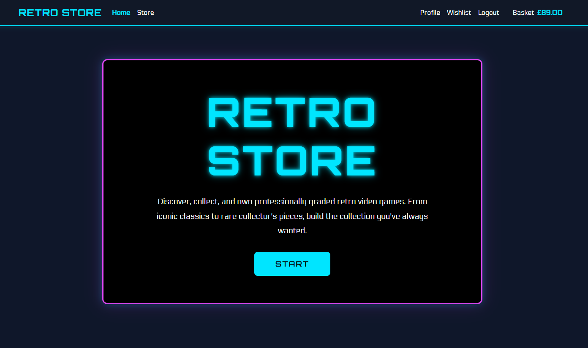

#### Store

* Browse a catalogue of retro games
* Responsive Bootstrap card layout
* Filtering by: Genre, Console, Availability
* Links to individual game detail pages

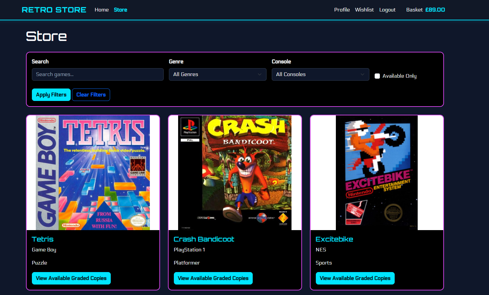

#### Game Detail Pages

* Displays game information
* Shows all graded copies associated with the game
* Sold items remain visible but are unavailable for purchase
* Available items can be added to the basket
* Games can be added to wishlist

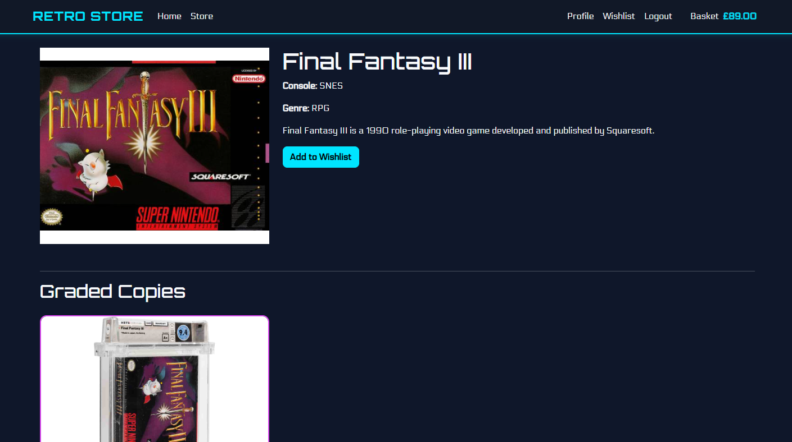

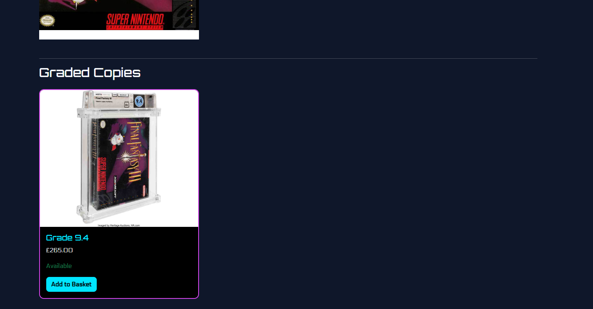

#### Wishlist

Authenticated users can:

* Add games to their wishlist
* Remove games from their wishlist
* Add notes to wishlist items
* Update existing notes
* Delete notes by clearing the text area and saving

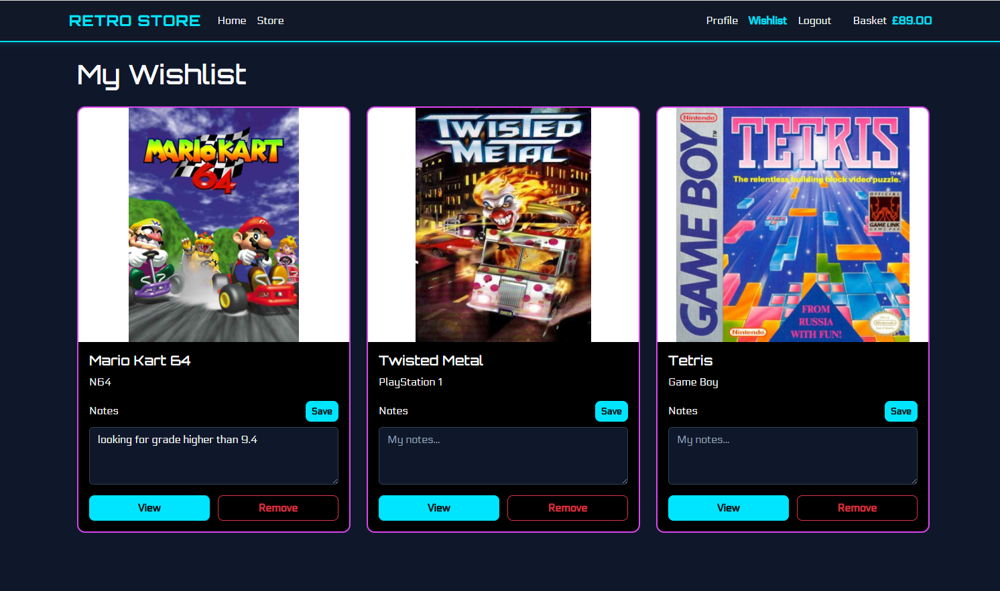

#### Basket

* Add graded items to the basket
* Remove items from the basket
* View basket contents and order total
* Continue shopping or proceed to checkout buttons

Because graded items are unique collectibles, quantity adjustments are not necessary

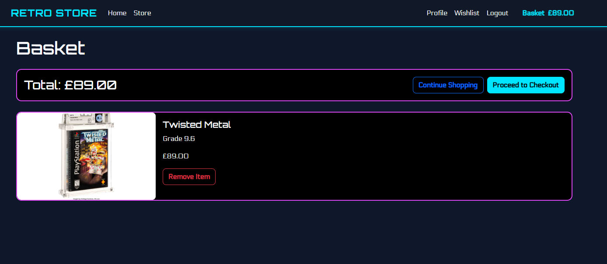

#### Checkout

* Secure checkout process using Stripe
* Shipping information form
* Successful checkout redirects users to an order confirmation page

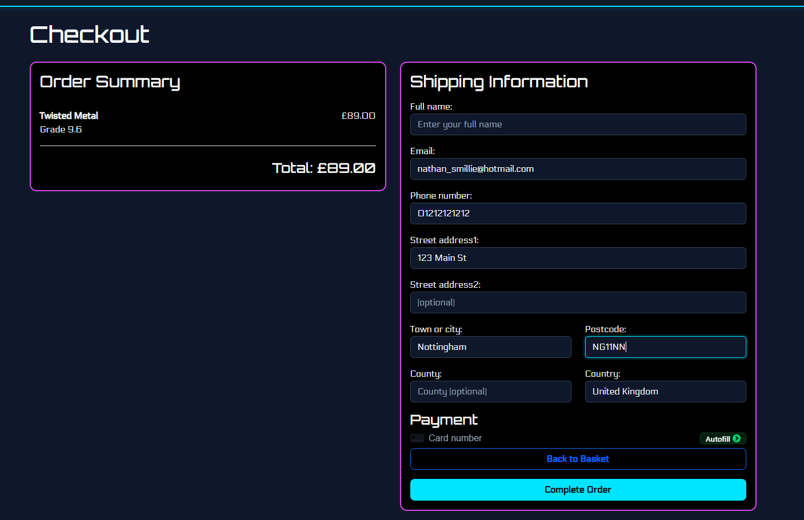

#### Order Management

Authenticated users can:

* View previous orders
* View order totals
* Save default shipping information for future purchases

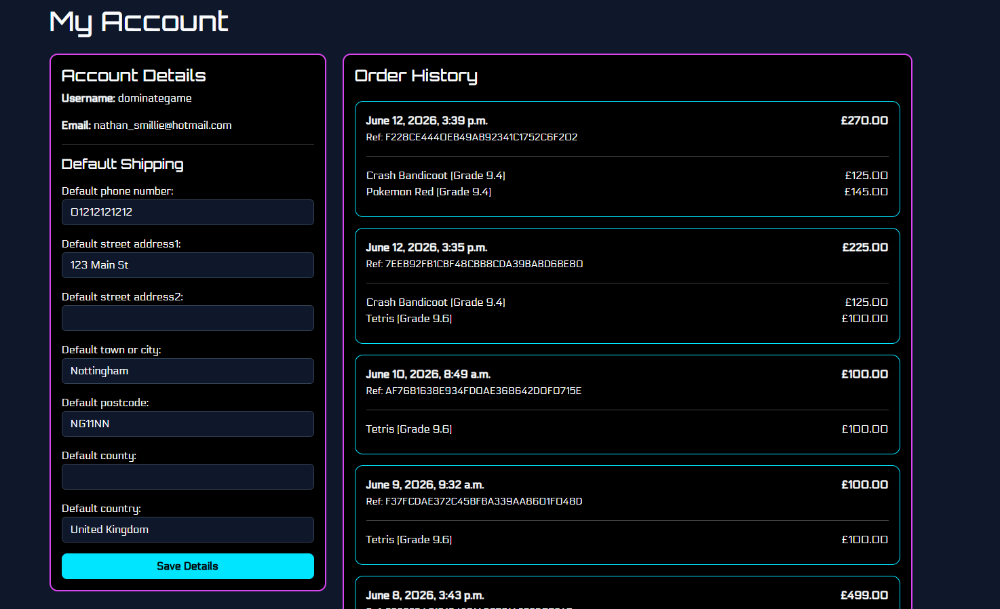

## Future Features

The following features could be added in future versions of the project:

#### Email Confirmations

* Send order confirmation emails after successful purchases
* Notify users when wishlist items become available. This would require giving users the option to save wishlist items, for example, with minimum grade or maximum price

#### Advanced Filtering

* Filter by price range and grade. This would require restructuring the filtering system to operate at the graded item level

#### Price History

A future version of the website could display historical price data for graded items. Users could:

* View a graph showing how prices for graded copies have changed over time
* Compare prices across different grades

This feature could be implemented when enough sales data has been collected

## CRUD Functionality
**Create:** 

Authenticated users can create wishlist entries by adding games to their wishlist. Users can also create notes associated with wishlist items to record additional information or preferences.

Administrators can create new games and graded items through Django admin.

**Read:** 

Users can view:

* Available games and graded items in the store
* Detailed game information
* Wishlist entries and notes
* Basket contents
* Order history

Administrators can view all games, graded items, users, and orders through Django admin.

**Update:** 

Users can update:

* Wishlist notes
* Default shipping information

Administrators can update:

* Game details
* Graded items

**Delete:** 

Users can delete:

* Games from their wishlist
* Notes from their wishlisted games

Administrators can delete:

* Games
* Graded items

Deleting a game automatically removes its associated graded items

# Technologies Used
## Languages
* HTML
* CSS
* JavaScript
* Python
* SQL

## Frameworks & Libraries
* Django
* Django Allauth
* Bootstrap
* Stripe
* Google Fonts
* Cloudinary

## Tools
* Github
* VS Code
* Heroku
* Chrome DevTools

# Testing

## User Story Testing
**User Story 1**

As a user, I want to create an account so that I can save my basket and wishlist.

**Expected Result:**

A user can register, log in, and remain authenticated across the site.

**Test Steps**
1. Navigate to the Register page
2. Enter a username, email address, and password
3. Submit the registration form
4. Navigate between pages
5. Log out of the account

**Result:** The user account was created successfully. The user was able to log in, remain authenticated across pages, and log out successfully.

**User Story 2**

As a user, I want to browse available retro games so I can find items to purchase.

**Expected Result:**

The user can view all available games with their title, console, genre, and cover image.

**Test Steps**
1. Navigate to the Store page
2. Scroll through the available games
3. Verify that each card displays the expected information

**Result:** All games were displayed correctly with their associated information.

**User Story 3**

As a user, I want to view detailed information about a game so I can decide if I want to buy it.

**Expected Result:**

Selecting a game opens a detail page containing all relevant information.

**Test Steps**
1. Navigate to the Store page
2. Click on a game
3. Verify that the game detail page loads
4. Verify that the page displays expected information

**Result:** The game detail page displayed the cover image, description, console, genre, and graded copies successfully.

**User Story 4**

As a user, I want to filter games by console, genre, price, and grade so I can find specific items quickly.

**Expected Result:**

The store updates to display only games matching the selected filters.

**Test Steps**
1. Navigate to the Store page
2. Select filters
3. Apply filters

**Result:** Price and grade are unavailable filters as the individual graded items are not shown on the Store page. Clicking on a game will take the user to the game detail page where this information will be shown.

**User Story 5**

As a user, I want to add graded games to my basket so I can purchase them later.

**Expected Result:**

Available graded items can be added to the basket.

**Test Steps**
1. Navigate to a game detail page
2. Click Add to Basket on an available graded item
3. Open the Basket page
4. Verify correct item is in the basket

**Result:** The selected graded item was added to the basket successfully.

**User Story 6**

As a user, I want to view my basket so I can see selected items and total cost.

**Expected Result:**

The basket displays selected items and calculates the total price correctly.

**Test Steps**
1. Add more graded items to the basket
2. Open the Basket page
3. Verify the displayed items and total price is correct

**Result:** The basket displayed the correct items and total price.

**User Story 7**

As a user, I want to update or remove items in my basket so I can adjust my purchase before checkout.

**Expected Result:**

Users can remove items from the basket.

**Test Steps**
1. Add an item to the basket
2. Open the Basket page
3. Click Remove Item

**Result:** The item was removed successfully. Note, quantity adjustment was not implemented because each graded item represents a unique item.

**User Story 8**

As a user, I want to securely pay for my items so I can complete my purchase.

**Expected Result:**

Users can complete checkout using Stripe.

**Test Steps**
1. Add items to the basket
2. Proceed to checkout
3. Enter shipping details
4. Use Stripe test card details
5. Submit the payment

**Result:** The payment was processed successfully and the order was created.

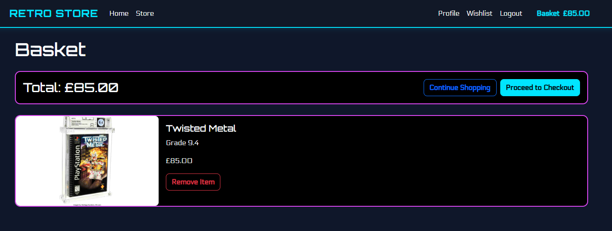

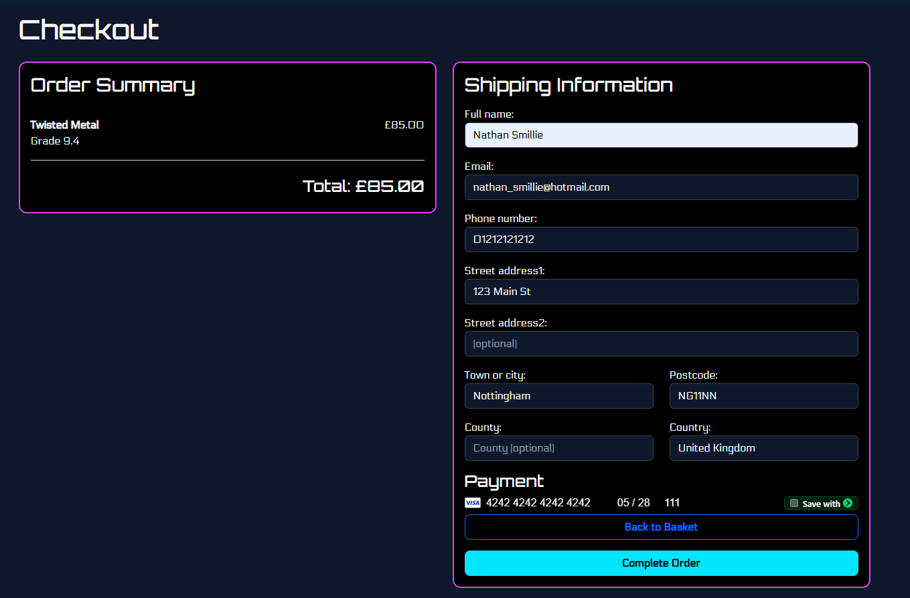

**User Story 9**

As a user, I want to see a confirmation after payment so I know my order was successful.

**Expected Result:**

A confirmation page displays the order details after checkout.

**Test Steps**
1. Complete a successful checkout
2. Review checkout success page

**Result:** The checkout success page displayed successfully with the correct order information.

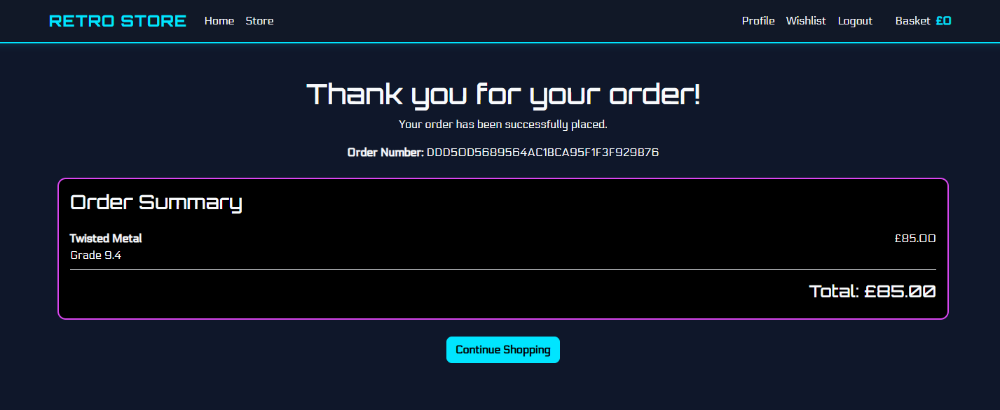

**User Story 10**

As a user, I want to save items to a wishlist so I can view them later.

**Expected Result:**

Users can add games to their wishlist and manage notes.

**Test Steps**
1. Open a game detail page
2. Add the game to the wishlist
3. Open the Wishlist page
4. Verify game was added to wishlist
5. Makes notes and save

**Result:** The wishlist item and notes were saved successfully and persisted after refreshing the page.

**User Story 11**

As a site owner, I want to add, edit, and delete products so I can manage inventory.

**Expected Result:**

The administrator can create, edit, and delete games and graded items.

**Test Steps**
1. Log into Django Admin
2. Create a new Game
3. Create a new Graded Item
4. Edit the game
5. Delete the game

**Result:** All CRUD operations were completed successfully through Django Admin

**User Story 12**

As a user, I want to view my past orders so I can track my purchases.

**Expected Result:**

Authenticated users can view previous orders and purchased items.

**Test Steps**
1. Complete a purchase
2. Navigate to Profile page
3. View the Order History section

**Result:** Previous orders were displayed correctly, including purchased items and totals.

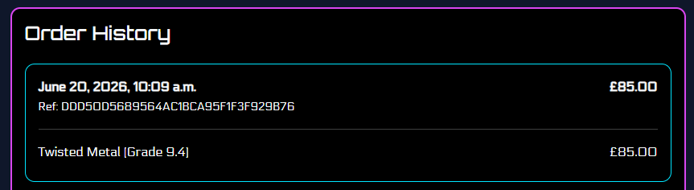

## Controls
All interactive controls were manually tested throughout the application.

### Buttons
* Start – Navigates users from the homepage to the store.
* Add to Basket – Adds an available graded item to the basket.
* Remove Item – Removes a graded item from the basket.
* Add to Wishlist – Saves a game to the user's wishlist.
* Save Notes – Updates notes attached to wishlist items.
* Proceed to Checkout – Begins the checkout process.
* Apply Filters – Filters games by console, genre, and availability.
* Clear Filters - Resets filters.
* Continue Shopping & Back to Store - Returns user to the store.

### Forms
* User authentication (registration and login)
* Checkout and shipping information
* Store filtering
* Wishlist notes
* Default shipping details on the profile page

### Navigation
The site uses a responsive navigation bar on all pages.

* Home
* Store
* Wishlist
* Profile
* Basket
* Login/Logout

The navigation bar collapses into a mobile-friendly menu on smaller screens to maintain usability across devices.

## Responsive Design
The website was designed using a mobile-first approach and tested across a range of screen sizes using Chrome DevTools.

Responsive features include:

* Bootstrap grid system used throughout the site
* Navigation bar collapses on mobile
* Cards stack vertically on smaller screens
* Buttons and forms remain accessible and readable across all screen sizes

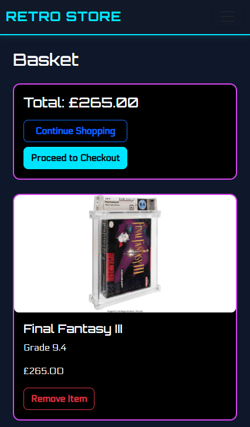

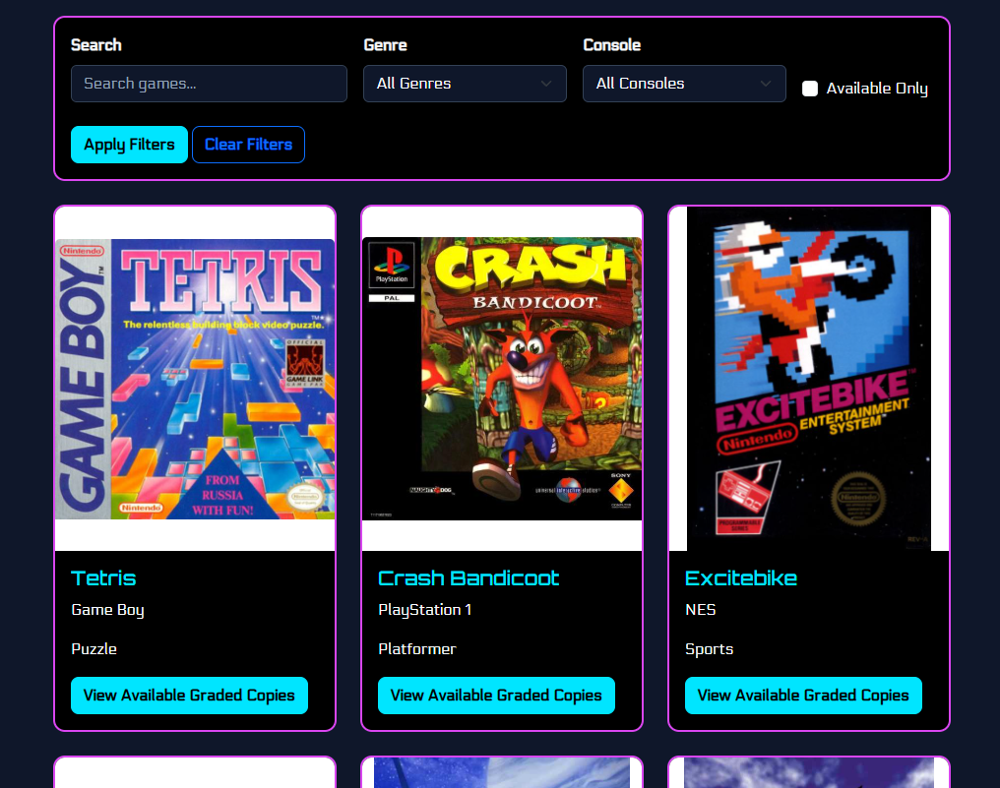

## Visual Feedback
Visual feedback is provided throughout the site to improve usability and inform users when actions have been completed successfully.

Examples include:

* Django messages and toast notifications
* Hover states on buttons and links
* Sold graded items are visually distinguished using reduced opacity and grayscale styling
* Active navigation links highlight the user's current location within the site
* Form validation messages are displayed when invalid data is submitted

## Bugs & Fixes

| Bug | Fix |
|------|-----|
| Sold graded items could still be purchased | Updated checkout logic to set `is_available=False` after successful order creation |
| Wishlist notes were not saving | Moved the Save button inside the form |
| Basket images overflowed card boundaries on mobile | Added dedicated basket image container styling with fixed dimensions |
| Basket action buttons became cramped on mobile | Added responsive flexbox styling |
| Order totals overflowed profile cards on smaller screens | Updated layout styling to allow prices to wrap correctly |
| Wishlist navbar link was not highlighted as active | Added active state logic |

## Validator Testing

### HTML Validation

All pages were validated no major HTML errors remain.

### CSS Validation

Custom CSS was tested using the W3C CSS Validator. No errors were found.

### Lighthouse Scores
**Performance:** 95

**Accessibility:** 100

**Best Practices:** 77

### Python Validation

Python code was validated using Flake8.

No errors (except E501) were found after correcting minor formatting issues.s

# Deployment
## GitHub Repository

The project repository was created using GitHub for version control and project management.

[GitHub](https://github.com/N-Smillie/retro-store-project)

## Heroku Deployment

The application was deployed using Heroku.
1. Create a new Heroku app
2. Connect the Heroku app to the GitHub repository
3. Configure the required environment variables (Config Vars)
4. Deploy the project from the main branch
5. Open the live applpication [Retrostore](https://retrostore-29fc610fcf73.herokuapp.com/)

# Credits

Images for Graded Items sourced from Heritage Auctions (https://www.ha.com/)
